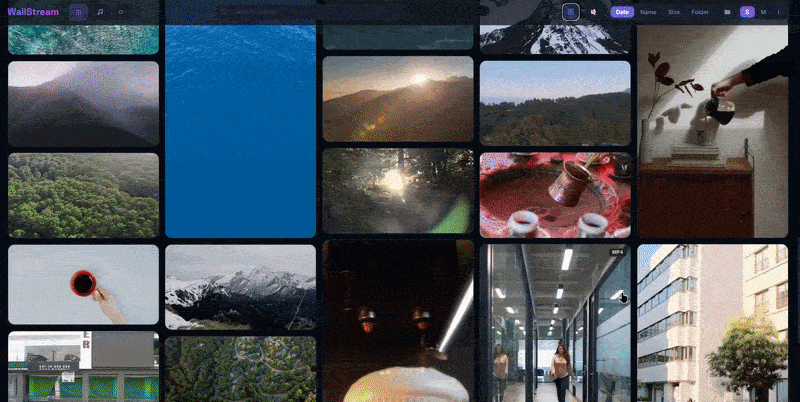
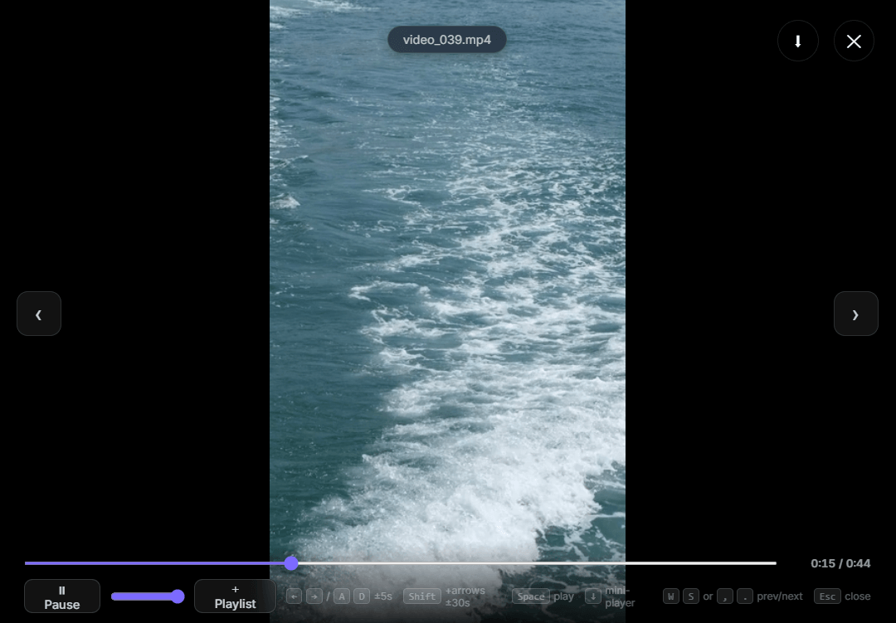
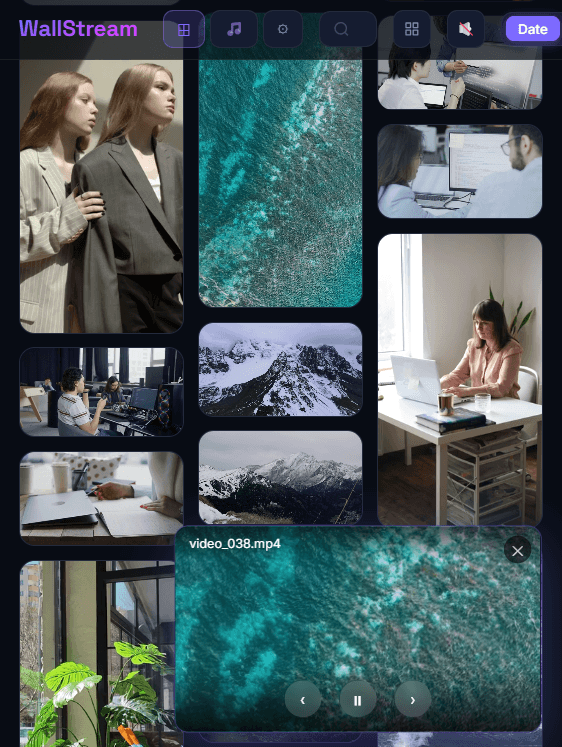
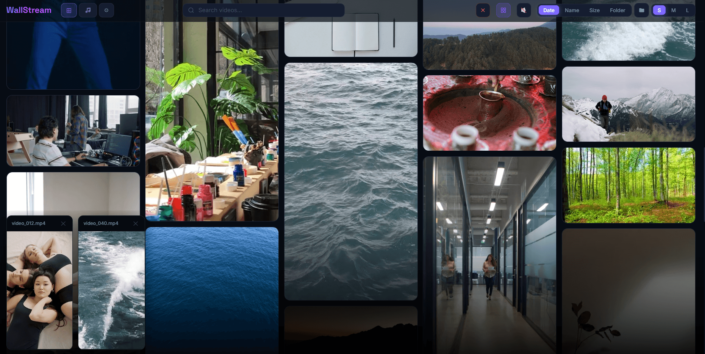
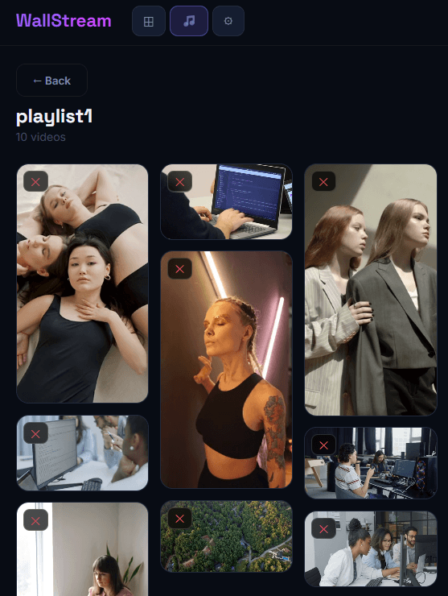
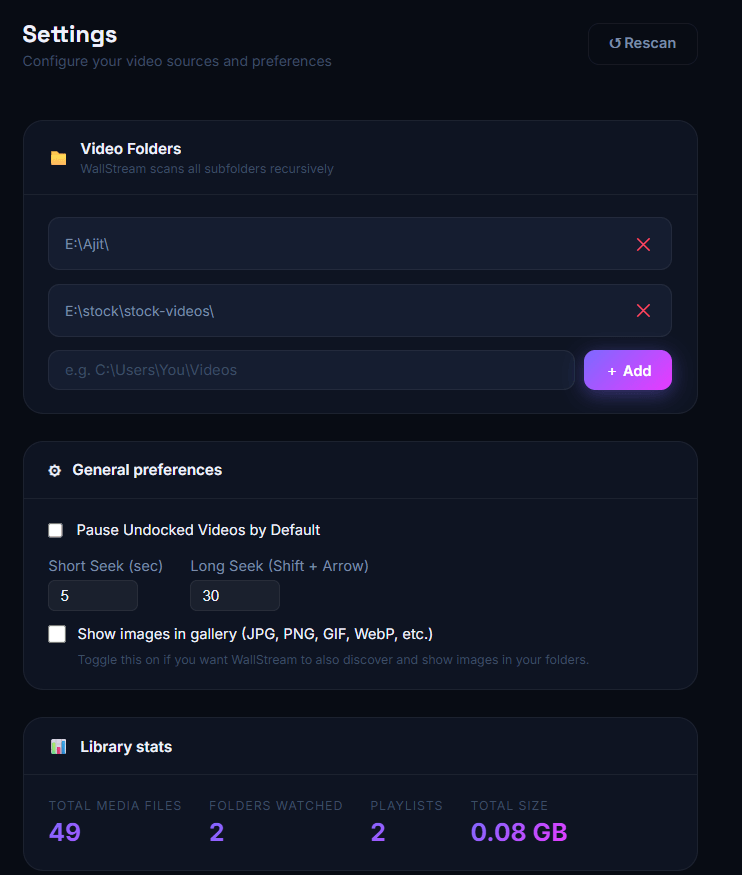

<div align="center">


# WallStream


*Your completely offline, lightning-fast local video gallery and media engine.*

[**Capabilities**](#-core-capabilities) •
[**Tech Stack**](#️-tech-stack--setup)

</div>

---

## 🚀 What is WallStream?

WallStream is a highly optimized, cross-platform media streaming engine built with Vite, React, and an Express.js server. It is specifically designed to handle absolutely massive local media libraries without crashing your computer, using modern streaming architecture and a purely cinematic dark-mode UI.

<p align="center">
  
</p>

---

## ⚡ Core Capabilities

### 🎥 Cinema-Grade Playback Modes
- **Wall Mode (`W`)**: A true multi-viewing mode. Disable basic hover-play, and every single video currently visible on your browser instantly starts playing in beautiful synchronization. Videos smoothly pause when scrolled off-screen to preserve memory.
- **Cinematic Lightbox**: Clicking a video immediately fades the app out into a blackout full-screen player with its own idle-hide progress UI and filename badge.

<p align="center">
  
  <br/><sub>Cinematic fullscreen lightbox player</sub>
</p>

- **Picture-in-Picture Mini-Player (`↓`)**: While in fullscreen, push the down-arrow to seamlessly shrink the video into a PiP floating player at the bottom of the screen, letting you browse your library in the background.

<p align="center">
  
  <br/><sub>PiP mini-player while browsing the library</sub>
</p>

- **Multi-Window Undocking (`⧉`)**: Instantly "undock" an unlimited amount of videos out of the grid. Rather than a messy window scatter, they automatically snap into a highly-organized, horizontally scrolling dock locked to the bottom of your screen.

<p align="center">
  
  <br/><sub>Multi-window dock with two videos playing simultaneously</sub>
</p>

### 🛡️ Precautionary Safeguards
- **Huge Video Fallback**: WallStream actively protects your browser's hardware decoders. If the backend detects any video file over **500 MB**, it refuses to load the underlying DOM `<video>` tag for that thumbnail. Instead, it renders an aesthetic `⚠️ Huge Video` fallback cover. You can click the cover to instantly spin the heavy file up within the safe, isolated Fullscreen Lightbox environment instead.

### 🗂️ Advanced Media Architecture
- **JS-Driven Masonry Columns**: Implements an incredibly robust JavaScript scaling algorithm to calculate pixel-perfect flex column grids—entirely eliminating the nasty layout jitter/reflow that kills standard CSS `column-count` layouts when elements lazily unmount.
- **TV-Mode Autoplay**: When a video finishes playing natively, the global queue immediately grabs the exact next indexed item from your current library/playlist and seamlessly auto-advances.
- **Persistent Mute**: Keeps track of a global `muted` state logic (`M`) across the entire timeline and across all hover or wall-mode videos.

### 📚 Management
- Instant, sub-second deep folder scanning for media files.
- Advanced keyboard shortcuts (`Esc` double-tap killswitches, `< / >` 5-second Arrow keys seeking, `Space` toggles).
- Local, completely portable customizable Playlists with persistent JSON config backups.
- Dynamic group-by folder sizes, sorting algorithms, and grid size modes.

<p align="center">
  
  <br/><sub>Playlist management panel</sub>
</p>

---

## 🛠️ Tech Stack & Setup

**Frontend**: React 18, TypeScript, Vite.js  
**Styling**: Pure CSS via Glass-Morphism Design concepts (`backdrop-filter`)  
**Backend**: Express.js Native Streams (HTTP Range chunks for zero RAM mounting)

<p align="center">
  
  <br/><sub>Settings panel</sub>
</p>

### Running WallStream locally:

**Option 1 — Release (recommended)**

1. Download the latest release archive from the [Releases](../../releases) page.
2. Extract the zip and run `WallStream.bat`.
3. *(Optional)* Right-click `WallStream.bat` → **Create shortcut** and place it anywhere (Desktop, Start Menu, etc.) to launch WallStream from anywhere with a double-click.

**Option 2 — From source**

```bash
# Install dependencies
npm install

# Start both the React UI and the Node.js Server concurrently
npm run dev
```

Visit `http://localhost:5173` in your browser to start your engine.

---

<div align="center">

Made with ❤️ by Ajit K.

</div>
